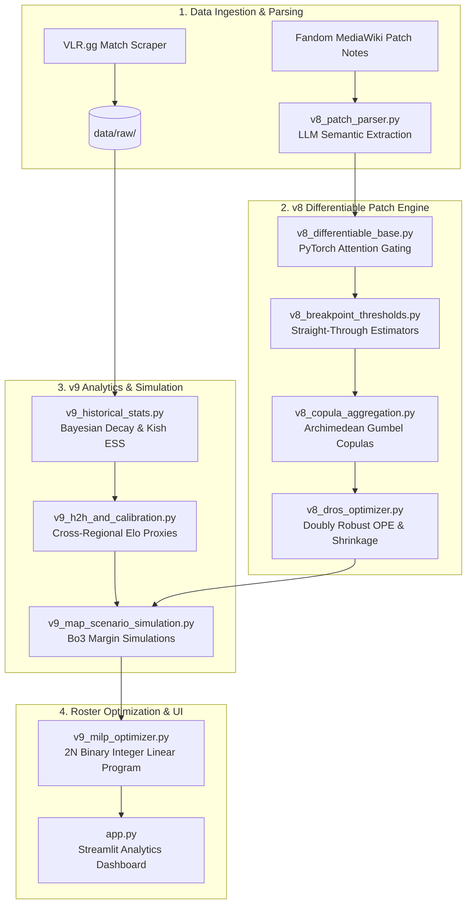

# VCT / VLF Daily Fantasy Sports (DFS) Predictive Engine & Differentiable Patch Analyzer

[](https://opensource.org/licenses/MIT)
[](https://www.python.org/)
[](https://pytorch.org/)
[](https://scipy.org/)
[](https://streamlit.io/)

An end-to-end quantitative research and roster optimization framework for professional Valorant (VCT / VLF). This engine bridges semantic game balance parsing, differentiable agent shock modeling, copula aggregation, Bayesian temporal skill tracking, and exact mathematical knapsack optimization under official VLF tournament rules.

---

## 🏛 System Architecture



### Core Architecture Components

1. **v8 Differentiable Patch Engine**
   - **Schema-Driven LLM Parsing (`v8_patch_parser.py`):** Structured wikitext extraction with fallback heuristics for agent stat deltas, projectile dynamics, and economy adjustments.
   - **PyTorch Attention Gating (`v8_differentiable_base.py`):** End-to-end differentiable module capturing non-linear agent interactions and composition synergies.
   - **Straight-Through Estimator Breakpoints (`v8_breakpoint_thresholds.py`):** Differentiable approximation of discrete Time-To-Kill (TTK) breakpoints across damage falloff bands and armor tiers.
   - **Archimedean Gumbel Copulas (`v8_copula_aggregation.py`):** Joint tail-dependence modeling for simultaneous multi-ability patch shocks.
   - **Doubly Robust OPE with Optimistic Shrinkage (`v8_dros_optimizer.py`):** Off-policy evaluation balancing direct estimation with inverse propensity weighting.

2. **v9 Analytics & 2N MILP Knapsack Solver**
   - **Bayesian Temporal Decay (`v9_historical_stats.py`):** Exponential decay weighting calibrated against Kish's Effective Sample Size (ESS) to prevent stale patch overfitting.
   - **Discrete Best-of-3 Margin Simulations (`v9_map_scenario_simulation.py`):** High-resolution Monte Carlo simulation of round margins and match length distributions.
   - **Cross-Regional Elo Proxies (`v9_h2h_and_calibration.py`):** Temperature-scaled Platt scaling and Isotonic regression for cross-league team adjustments.
   - **2N Binary Mixed-Integer Linear Programming (`v9_milp_optimizer.py`):** Exact mathematical optimization via `scipy.optimize.milp` enforcing strict $100.0 VP salary caps, 11-player roster cardinality, IGL assignment, role bounds ($2 \le \text{role} \le 5$), and team concentration limits ($\le 2$ per team).

---

## 🧠 Socio-Mechanical Meta-Awareness Subsystems

The engine models non-linear competitive human dynamics through specialized meta-mechanic layers:

- **Agent Mastery Inertia Buffer:** Dampens theoretical patch nerf penalties for high-mastery veteran players on comfort picks, accounting for muscle memory and playbook familiarity.
- **Meta-Network Adjacency:** Propagates indirect counter-meta value shocks across the agent relationship graph (e.g., a direct buff to Phoenix generates positive second-order utility for Sage).
- **Skill-Ceiling CVaR Expansion:** Expands right-tail Conditional Value-at-Risk (CVaR) projections for elite Duelists targeting high-variance, non-linear bracket scoring.
- **Adaptive Momentum (Jump-Diffusion):** Uses automated regime-shift detection ($\alpha = 0.60$) to identify tactical breakthrough innovations and rapid meta realignments.

---

## 📜 Official VLF Ruleset Engine Summary

The predictive pipeline is built against the official VLF tournament scoring contract:

- **Map Aggregation:** Best-of-2 map scores per Gameweek (highest 2 individual map fantasy scores are counted).
- **Bracketed Kill Scoring:**
  - $0$ kills: $-3.0$ pts
  - $1 \text{--} 4$ kills: $-1.0$ pt
  - $5 \text{--} 9$ kills: $0.0$ pts (baseline)
  - $10$ kills: $+1.0$ pt
  - Each $+5$ kills above $10$: additional $+1.0$ pt (e.g., $15\text{k} \rightarrow +2.0$, $20\text{k} \rightarrow +3.0$)
- **Multi-Kill & Event Bonuses:** 4K ($+3.0$), Ace ($+5.0$), Overtime Ace ($+7.0$), First Bloods ($+1.0$), Clutches, and Round Sweep differentials.
- **Dynamic In-Game Leader (IGL) Bonus:** Designating an active roster member as IGL applies a $2.0\times$ multiplier to their total match points.

---

## 🚀 Quickstart & Installation

### Prerequisites
- Python 3.10 or higher
- Git

### 1. Clone & Environment Setup
```bash
# Clone repository
git clone https://github.com/<your-username>/vct-prediction-model.git
cd vct-prediction-model

# Create and activate virtual environment
python -m venv venv
# Linux / macOS:
source venv/bin/activate
# Windows (PowerShell):
.\venv\Scripts\Activate.ps1
# Windows (CMD):
.\venv\Scripts\activate.bat

# Install strictly pinned dependencies
pip install -r requirements.txt
```

### 2. Configure Environment Variables
```bash
cp .env.example .env
```
Open `.env` and configure your API keys (e.g., Google Gemini API key if active LLM wikitext parsing is required). Offline heuristics and synthetic mock data work without external API keys.

---

## 💻 Execution Entrypoints

### Full Data Ingestion & Feature Pipeline
```bash
python run_pipeline.py
```

### MLOps Training & Walk-Forward Backtesting
```bash
python pipeline.py
```

### Interactive Streamlit Analytics Dashboard
```bash
streamlit run app.py
```

### Running the Test Suite
```bash
pytest -v
```

---

## 📁 Repository Layout

```
├── app.py                     # Streamlit interactive DFS & match prediction dashboard
├── requirements.txt           # Strictly pinned project dependencies
├── .env.example               # Template environment configuration
├── config.yaml                # Core model hyperparameters and data paths
├── data/
│   └── sample/                # Synthetic player & match databases for out-of-the-box usage
│       └── sample_players_db.json
├── docs/                      # Technical onboarding & architecture specifications
├── scrapers/                  # Match and patch notes extraction modules
├── tests/                     # Unit and integration test suites
├── v8_*.py                    # Differentiable Patch Engine modules (v8 architecture)
└── v9_*.py                    # Analytics, Simulation & MILP Optimization modules (v9 architecture)
```

---

## 📄 License

This project is licensed under the MIT License - see the [LICENSE](LICENSE) file for details.
