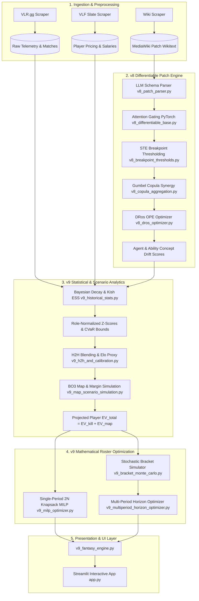

# 00. System Overview & Architecture Roadmap

Welcome to the **VCT / VLF DFS Prediction Engine** repository. This document serves as the master entrypoint for software engineers, quantitative researchers, and data scientists onboarding onto the codebase.

---

## 1. High-Level Mission

The engine generates risk-adjusted Daily Fantasy Sports (DFS) roster selections and multi-gameweek transfer strategies for the **Valorant Fantasy League (VLF)**. It achieves this by combining:

1. **Scraped Telemetry & VLR Stats:** Detailed round-level and match-level statistics covering pro teams and players across all official VCT international and regional leagues.
2. **The v8 Differentiable Patch Engine:** A PyTorch neural subsystem that semantically parses game balance patch notes via an LLM, identifies physical/mechanical exploit removals vs. cosmetic fixes, models multi-ability synergistic shock via Archimedean Copulas, and computes policy value via Doubly Robust Off-Policy Evaluation (DRos).
3. **The v9 MILP Knapsack Solver & Analytics Engine:** An exact mathematical programming module utilizing `scipy.optimize.milp` over an expanded $2N$ decision variable space ($N$ roster choices + $N$ dynamic IGL selections) subject to strict budget, role balance, team ownership, and multi-period tournament bracket paths.
4. **Interactive Web Dashboard:** A Streamlit visualizer (`app.py`) providing live interactive roster optimization, scenario tweaking, telemetry inspectability, and tournament horizon forecasting.



---

## 2. Directory Layout & Key Modules

```
vct-prediction-model/
├── config/                         # Configuration and benchmark parameters
├── data/
│   ├── raw/                        # Unprocessed HTML / wikitext scrapes
│   └── processed/                  # Normalized JSON databases (vfl_players_db.json, etc.)
├── docs/                           # Architecture specs, model cards, and audit documents
│   ├── architecture_audit_v8_v9.md # Verification report & assumption audit
│   └── onboarding/                 # Complete multi-part onboarding guides
├── ml/                             # MLOps supervised modeling (LightGBM, XGBoost, SHAP)
│   ├── data_quality.py             # Telemetry validation & data health
│   ├── dataset_builder.py          # Training matrix generation
│   ├── feature_builder.py          # Rolling temporal feature engineering
│   ├── train.py / evaluate.py      # Training pipelines & calibration metrics
│   └── model_registry.py           # Champion / Challenger staging
├── scrapers/                       # Automated ingestion scripts
│   ├── incremental_vlr_scraper.py  # Incremental VLR.gg match harvest
│   ├── vfl_scraper.py              # Live VLF slate salaries and rosters
│   ├── wiki_scraper.py             # Liquipedia / Fandom patch notes harvester
│   └── patch_ingestor.py           # Raw patch parser runner
├── v8_patch_parser.py              # LLM Pydantic parser & Bug Fix classifier
├── v8_differentiable_base.py       # PyTorch Attention Gating & Category Elasticities
├── v8_breakpoint_thresholds.py     # Custom Straight-Through Estimator (STE)
├── v8_copula_aggregation.py        # Archimedean Gumbel Copula multi-ability synergy
├── v8_dros_optimizer.py            # Doubly Robust Optimistic Shrinkage (DRos) OPE
├── v9_historical_stats.py          # Bayesian time-decay, Kish ESS & CVaR floor/ceiling
├── v9_map_scenario_simulation.py   # Discrete BO3 map outcomes & margin probabilities
├── v9_h2h_and_calibration.py       # Head-to-Head blending, Elo proxy & momentum loop
├── v9_milp_optimizer.py            # 2N decision vector MILP knapsack solver
├── v9_bracket_monte_carlo.py       # Tournament bracket simulation engine
├── v9_multiperiod_horizon_optimizer.py # Multi-gameweek transfer planning solver
├── v9_fantasy_engine.py            # Top-level unified API facade
├── run_pipeline.py                 # Full system update linear orchestration script
├── pipeline.py                     # V10 MLOps experiment & backtesting pipeline
└── app.py                          # Streamlit interactive UI application
```

---

## 3. Onboarding Guide Navigation

To explore specific subsystems in depth, proceed through the documentation suite in sequence:

- **[01. Data Pipeline & Ingestion](file:///c:/Users/91704/Desktop/vct-prediction-model/docs/onboarding/01_DATA_PIPELINE_AND_INGESTION.md):** Scrapers, database schemas, telemetry metrics, and the official VLF scoring rules engine.
- **[02. v8 Differentiable Patch Engine](file:///c:/Users/91704/Desktop/vct-prediction-model/docs/onboarding/02_V8_DIFFERENTIABLE_PATCH_ENGINE.md):** LLM parsing, Pydantic schemas, PyTorch Attention Gating, STE Breakpoint Thresholding, Gumbel Copula synergy, and DRos OPE.
- **[03. v9 DFS Optimizer & Analytics](file:///c:/Users/91704/Desktop/vct-prediction-model/docs/onboarding/03_V9_DFS_OPTIMIZER_AND_ANALYTICS.md):** Bayesian decay, role z-score modifiers, CVaR 10/90 calculations, 2N MILP knapsack solver, and multi-period horizon optimization.
- **[04. Developer & Operations Guide](file:///c:/Users/91704/Desktop/vct-prediction-model/docs/onboarding/04_DEVELOPER_AND_OPERATIONS_GUIDE.md):** Local setup, running pipelines, executing test suites, CLI debugging, and known architectural blind spots.
- **[Master Architecture Audit](file:///c:/Users/91704/Desktop/vct-prediction-model/docs/architecture_audit_v8_v9.md):** Full list of 19 verified code realities versus common design assumptions.
