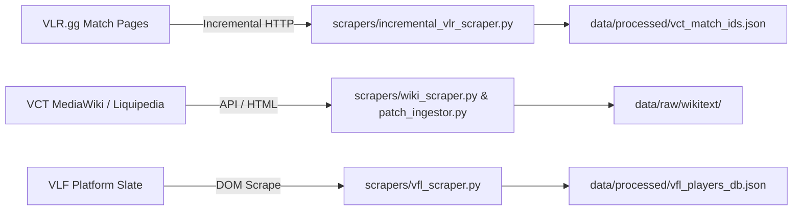

# 01. Data Pipeline, Ingestion & VLF Scoring Rules

This guide details how external esports telemetry is harvested, parsed, stored, and evaluated against the official Valorant Fantasy League (VLF) ruleset.

---

## 1. Scraping & Ingestion Architecture

The ingestion pipeline pulls from three primary external surfaces:

### Ingestion Components

1. **VLR.gg Match Scraper (`scrapers/incremental_vlr_scraper.py`):**
   - Harvests pro match IDs, map picks/bans, round history, player ACS, K/D/A, ADR, KAST%, and First Kills/Deaths.
   - Avoids redundant downloads by maintaining a persistent `data/processed/vct_match_ids.json` registry.
   - Supports event whitelisting via CLI arguments (e.g. `--whitelist "Champions 2026,Masters London"`).

2. **VCT Wiki & Patch Notes Harvester (`scrapers/wiki_scraper.py` & `scrapers/patch_ingestor.py`):**
   - Retrieves official MediaWiki patch wikitext strings from official documentation and community wikis.
   - Saves raw text strings into `data/raw/` for downstream semantic extraction by the v8 NLP engine.

3. **VLF Pricing & Slate Ingestion (`scrapers/vfl_scraper.py`):**
   - Ingests active player prices (in VP / thousands), current tournament stage allocations, and official role tags.
   - Saves records into `data/processed/vfl_players_db.json`.

---

## 2. Ingested Telemetry Data Contract

While historical player records are loaded as JSON objects without a strict Pydantic model (to maintain backward compatibility across multiple scraper generations), the analytics engine (`v9_historical_stats.py`, `v9_fantasy_engine.py`) expects the following schema dictionary per player:

| Field Name | Type | Unit / Range | Description |
|---|---|---|---|
| `player_name` / `name` | `str` | Handle | Standardized pro player handle (e.g. `"aspas"`, `"Chronicle"`). |
| `team` / `team_name` | `str` | Team Name | Standardized organization name (e.g. `"Sentinels"`, `"Fnatic"`). |
| `role` | `str` | Canonical Role | One of `"Duelist"`, `"Initiator"`, `"Controller"`, `"Sentinel"`. |
| `price` / `cost` / `vp` | `float` | VP ($5.0 - $15.0$) | Player salary. Normalization rule: if price $> 100$, price is divided by $1000$ (e.g., $8500 \to 8.5\text{ VP}$). |
| `ppg` | `float` | Fantasy Pts | Raw historical unweighted points per game. |
| `scores_history` | `List[float]` | Fantasy Pts | Historical array of fantasy points per completed match/gameweek. |
| `days_elapsed` | `List[float]` | Days | Array of elapsed days from current date for each element in `scores_history`. |
| `adr` | `float` | Damage / Round | Average Damage per Round (typically $100.0 - 180.0$). |
| `kast` | `float` | $[0.0, 1.0]$ or $[0, 100]$ | Kill, Assist, Survived, or Traded round percentage. |
| `fd` | `float` | First Deaths / Round | Average first deaths conceded per round ($0.03 - 0.20$). |
| `std` / `std_dev` | `float` | Std Deviation | Empirical historical score standard deviation. |

---

## 3. The Official VLF Scoring Ruleset

The scoring engine strictly mirrors the official rules specified in [`VLF Rules International.txt`](file:///c:/Users/91704/Desktop/vct-prediction-model/VLF%20Rules%20International.txt).

### Rule 1: Gameweek Score Aggregation ("Best 2 Maps")
- A player's Gameweek total is determined by taking their **highest 2 individual map scores** in that Gameweek.
- *Example:* If a player competes in 3 maps across a series and scores $[14, 18, 6]$, their recorded score is $18 + 14 = 32$ points (the lowest map of 6 is dropped).

### Rule 2: Kill Points per Map (Bracketed Scoring)
Kill points are **non-linear and bracketed** (not scored per individual kill):
- **0 kills in a map:** $-3\text{ points}$
- **1 to 4 kills in a map:** $-1\text{ point}$
- **5 to 9 kills in a map:** $0\text{ points}$ (neutral baseline)
- **10 kills in a map:** $+1\text{ point}$
- **Additional kills beyond 10:** $+1\text{ point}$ for every additional 5 kills completed:
  - $15\text{ kills} \to +2\text{ points}$
  - $20\text{ kills} \to +3\text{ points}$
  - $25\text{ kills} \to +4\text{ points}$
  - $30\text{ kills} \to +5\text{ points}$

### Rule 3: Multi-Kill Bonuses per Round
- **4K in a round:** $+1\text{ point}$
- **5K+ (Ace) in a round:** $+3\text{ points}$
- **6K (Overtime/Resurrection Ace):** $+5\text{ points}$
- **7K in a round:** $+10\text{ points}$

### Rule 4: Map Win & Margin Outcomes
- **Any map win:** $+1\text{ point}$
- **Map win by 5–9 rounds:** $+1\text{ point}$
- **Map win by 10+ rounds:** $+2\text{ points}$
- **Map loss by 10+ rounds:** $-1\text{ point}$
- **13–0 Sweep bonus (flawless map win):** $+5\text{ points}$
- **0–13 Sweep penalty (flawless map loss):** $-5\text{ points}$

### Rule 5: Series Outcome Bonuses
- **2–0 Best of 3 clean sweep:** $+2\text{ points}$
- **3–0 Best of 5 clean sweep:** $+4\text{ points}$
- **3–1 Best of 5 win:** $+1\text{ point}$

### Rule 6: VLR Rating 2.0 Bonuses
- **Highest average VLR rating in match:** $+3\text{ points}$
- **2nd highest average VLR rating:** $+2\text{ points}$
- **3rd highest average VLR rating:** $+1\text{ point}$
- **Achieving $\ge 1.50$ average VLR rating:** $+1\text{ point}$
- **Achieving $\ge 1.75$ average VLR rating:** $+2\text{ points}$
- **Achieving $\ge 2.00$ average VLR rating:** $+3\text{ points}$

### Rule 7: IGL Doubling Modifier
- The single roster member designated as **In-Game Leader (IGL)** receives a **$2.0\times$ multiplier** across all positive and negative points earned during the Gameweek.

> **Important Reminder on Unscored Metrics:**  
> Deaths (except First Deaths in telemetry modifiers), Assists, First Bloods, and Clutches are **not individually scored** in the VLF ruleset. Do not attempt to add arbitrary linear point additions for these metrics.
