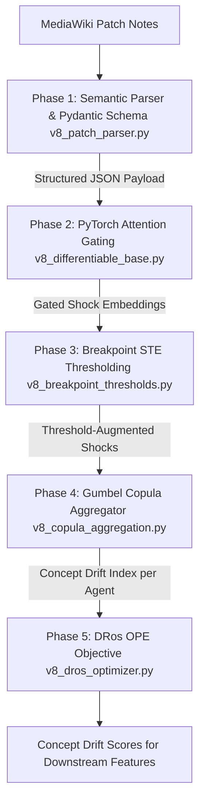

# 02. The v8 Differentiable Patch Engine

The **v8 Differentiable Patch Engine** replaces legacy static heuristics (e.g. static weights like `combat=1.2`, `Signature=0.40`) with an end-to-end differentiable PyTorch pipeline. It extracts semantic patch notes using an LLM, maps physical exploit removals, models non-linear gameplay threshold crossings, aggregates synergistic multi-ability buffs/nerfs via Archimedean Copulas, and estimates policy values via Doubly Robust Off-Policy Evaluation (DRos).

---

## 1. Subsystem Architecture Overview



---

## 2. Phase 1: Semantic Parsing & The Bug Fix Paradigm (`v8_patch_parser.py`)

### Pydantic Schema Contract

The LLM is prompted to return strictly validated JSON matching two Pydantic v2 schemas:

```python
class PatchChangeItem(BaseModel):
    agent: str = Field(..., description="Standardized agent name, e.g., 'Neon', 'KAY/O', 'Vandal'")
    ability: str = Field(..., description="Ability or weapon section, e.g., 'High Gear', 'Tailwind'")
    stat_modified: str = Field(..., description="Specific mechanic or stat modified")
    old_value: Optional[Union[float, int, str]] = None
    new_value: Optional[Union[float, int, str]] = None
    is_mechanical_removal: bool = Field(
        ...,
        description="CRITICAL: True for physics/movement/collision/animation cancel exploit fixes."
    )
    raw_evidence: Optional[str] = Field(None, description="Lossless ground-truth wikitext snippet")

class PatchExtractionPayload(BaseModel):
    version: str
    date: Optional[str] = None
    changes: List[PatchChangeItem] = Field(default_factory=list)
    raw_wikitext_hash: Optional[str] = None
```

### The Bug Fix Paradigm
Standard esports bug fixes (e.g. HUD alignment, spectator camera glitches, audio loops) have zero meta impact. However, developers frequently label advanced physics exploits (slide cancels, momentum boosts, collision clipping, animation cancels) as "bug fixes".
- When an exploit fix alters movement geometry or combat physics, `is_mechanical_removal` is set to `True`.
- In downstream tensor construction, non-mechanical bug fixes receive zero weight, while mechanical exploit removals carry full shock magnitude ($\Delta = -1.0$).

---

## 3. Phase 2: Differentiable Base & Attention Gating (`v8_differentiable_base.py`)

Rather than relying on static scalar constants, `PatchEmbeddingBase` parameterizes category elasticities and ability power budgets as trainable PyTorch tensors.

### Input Feature Space & Context Construction
For $M$ extracted patch items:
- Category indices: `combat` (0), `ability` (1), `movement` (2), `economy` (3), `general` (4).
- Ability tier indices: `signature` (0), `ultimate` (1), `basic` (2), `passive` (3), `general` (4).
- Continuous features: normalized numeric delta ($\Delta_{\text{norm}}$), mechanical removal flag ($\mathbb{I}_{\text{mech}}$), and numeric presence flag ($\mathbb{I}_{\text{numeric}}$).

$$\mathbf{X}_{\text{raw}} = \left[ \mathbf{e}_{\text{cat}} \,\|\, \mathbf{e}_{\text{ab}} \,\|\, \Delta_{\text{norm}} \,\|\, \mathbb{I}_{\text{mech}} \,\|\, \mathbb{I}_{\text{numeric}} \right] \in \mathbb{R}^{M \times 35}$$

### Context Projection & Attention Gating
The raw context is projected into a latent representation $\mathbf{X}_{\text{context}} \in \mathbb{R}^{M \times 32}$:
$$\mathbf{X}_{\text{context}} = \text{Linear}_{32 \to 32}\left( \text{SiLU}\left( \text{Linear}_{35 \to 32}(\mathbf{X}_{\text{raw}}) \right) \right)$$

The dynamic attention gate $\beta_{\text{dynamic}}$ modulates the magnitude of the shock:
$$\beta_{\text{dynamic}} = \sigma\left( \mathbf{W}_{\text{attn}} \mathbf{X}_{\text{context}} + b \right) \in (0, 1)^{M \times 1}$$

### Gated Shock Calculation
$$\mathbf{S}_{\text{base}} = \Delta_{\text{effective}} \odot \left( \mathbf{w}_{\text{ab}} \odot \boldsymbol{\beta}_{\text{cat}} \right) \in \mathbb{R}^{M \times 16}$$
$$\mathbf{S}_{\text{gated}} = \beta_{\text{dynamic}} \odot \mathbf{S}_{\text{base}} \in \mathbb{R}^{M \times 16}$$

---

## 4. Phase 3: Breakpoint Thresholding & STE (`v8_breakpoint_thresholds.py`)

Continuous gradient estimators fail when balance changes cross discrete gameplay thresholds (such as weapon headshot damage falling from $155$ to $145\text{ HP}$, which crosses the $150\text{ HP}$ heavy shield kill breakpoint and shifts Time-To-Kill by a full bullet).

### Straight-Through Estimator (STE)
`StraightThroughStep` implements a hard step function in the forward pass while allowing unmodified gradients to flow through in the backward pass:

```python
class StraightThroughStep(torch.autograd.Function):
    @staticmethod
    def forward(ctx, x: torch.Tensor, threshold: float = 150.0) -> torch.Tensor:
        ctx.save_for_backward(x, torch.tensor(threshold, dtype=x.dtype, device=x.device))
        return (x >= threshold).to(x.dtype)

    @staticmethod
    def backward(ctx, grad_output: torch.Tensor):
        # Identity gradient pass-through (bypasses the Dirac delta trap)
        return grad_output.clone(), None
```

### Soft Sigmoid Surrogate Relaxation
For continuous relaxation during optimization, `SoftBreakpointSurrogate` provides a temperature-controlled sigmoid:
$$y = \sigma\left( \frac{x - \theta}{\tau_{\text{temp}}} \right)$$
- $\theta$: threshold parameter (default $150.0$).
- $\tau_{\text{temp}}$: **trainable parameter** (`nn.Parameter`) clamped at $\min=10^{-3}$.

### Threshold Crossing Amplification
When a stat transitions from above the breakpoint to below it:
$$\text{Crossing} = \mathbb{I}_{\text{was\_above}} \cdot (1 - \mathbb{I}_{\text{is\_above}})$$
$$\mathbf{S}_{\text{fused}} = \mathbf{S}_{\text{gated}} \cdot \left( 1.0 + \text{crossing\_weight} \cdot \text{Crossing} \right)$$

---

## 5. Phase 4: Synergistic Copula Aggregation (`v8_copula_aggregation.py`)

Independent probabilistic union ($\text{Drift} = 1 - \prod (1 - S_i)$) fails to model the non-linear coupling when multiple core abilities of an agent are nerfed simultaneously. `GumbelCopulaAggregator` models upper-tail dependence using an **Archimedean Gumbel Copula**.

### Mathematical Formulation
1. **Dependence Parameter:**
   $$\theta = 1.0 + \text{Softplus}(\text{raw\_theta}) \in [1.0, \infty), \quad \alpha = \frac{1}{\theta} \in (0, 1.0]$$
2. **Upper-Tail Dependence Coefficient:**
   $$\lambda_U = 2 - 2^{1/\theta}$$
   - When $\theta = 1.0 \implies \lambda_U = 0$ (collapses to independent union).
   - When $\theta > 1.0 \implies \lambda_U > 0$ (synergistically amplifies co-occurring shocks).
3. **Copula Aggregation:**
   $$u_i = 1.0 - \text{clamp}(S_i, 0, 1 - \epsilon)$$
   $$\psi(u_i) = (-\ln u_i)^\alpha$$
   $$C(u_1, \dots, u_d; \alpha) = \exp\left( -\left( \sum_{i=1}^d \psi(u_i) \right)^{1/\alpha} \right)$$
   $$\text{Concept Drift Index} = 1.0 - C(u_1, \dots, u_d; \alpha)$$

`AgentGroupedCopulaAggregator` groups extracted changes by agent name string and applies the Gumbel Copula independently across each agent's set of affected abilities.

---

## 6. Phase 5: Off-Policy Evaluation & DRos (`v8_dros_optimizer.py`)

To train the patch shock weights against historical pro match outcomes without infinite variance explosions from standard Inverse Propensity Scoring (IPS), the engine implements **Doubly Robust Estimator with Optimistic Shrinkage (DRos)**.

### Sequential Direct Method ($q_{\text{hat}}$)
A 1-layer LSTM reads sequences of round state features (economy, ult charge, loadout values) and predicts baseline round win probabilities:
$$q_{\text{hat}}(x, a) = \sigma\left( \text{MLP}(\mathbf{h}_{\text{final}}) \right) \in (0, 1)^4$$

### Optimistic Shrinkage Importance Weights
Given target policy $\pi_e(a \mid x)$ and logging policy $\pi_0(a \mid x)$, the raw importance ratio is $w = \pi_e / \pi_0$. DRos shrinks extreme weights using shrinkage parameter $\lambda = 5.0$:
$$w_\lambda(x, a) = \frac{\lambda \cdot w(x, a)}{w(x, a)^2 + \lambda}$$
Theoretical ceiling: $w_\lambda \le \frac{\sqrt{\lambda}}{2} = \frac{\sqrt{5}}{2} \approx 1.118$.

### DRos Policy Value Estimator
$$V_{\text{DRos}}(\pi_e; \lambda) = \frac{1}{n} \sum_{i=1}^n \left[ \sum_{a} \pi_e(a \mid x_i) q_{\text{hat}}(x_i, a) + w_\lambda(x_i, a_i) \left( r_i - q_{\text{hat}}(x_i, a_i) \right) \right]$$
The model minimizes MSE loss between the predicted Concept Drift expected value and $V_{\text{DRos}}$.
