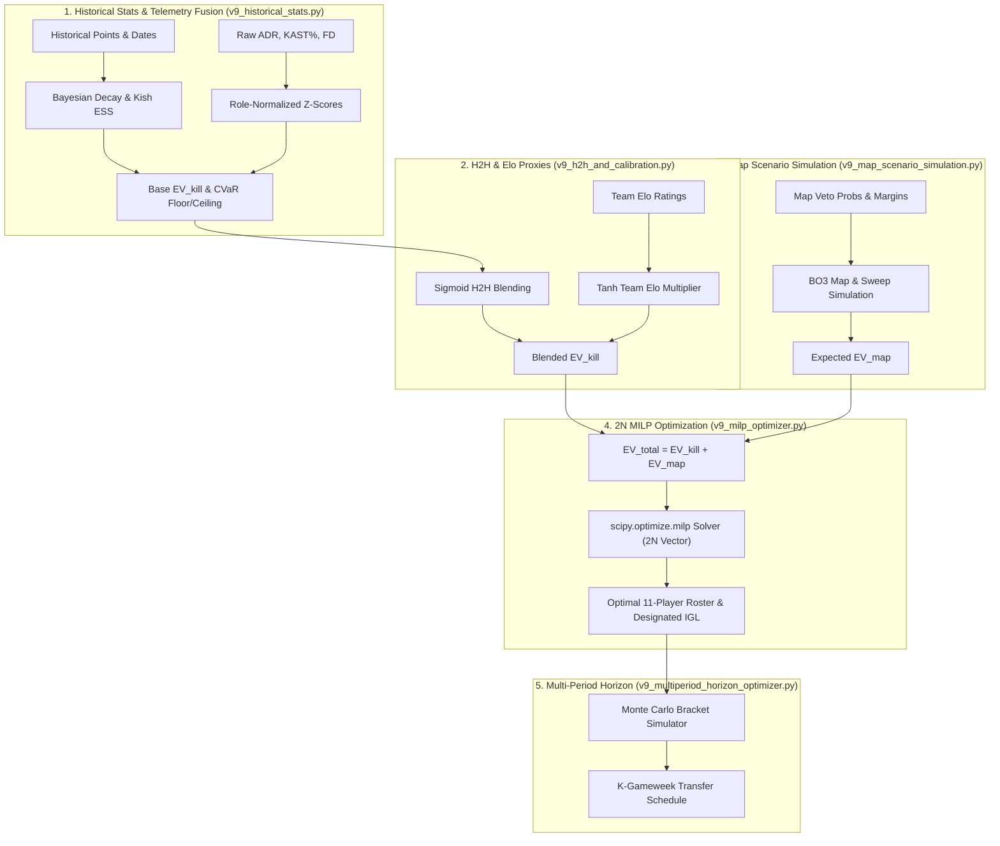

# 03. The v9 DFS Optimizer & Analytics Engine

The **v9 DFS Engine** transforms historical player performance, match telemetry, map scenarios, and tournament bracket paths into an optimal 11-player VLF fantasy squad using exact mathematical programming.

---

## 1. End-to-End Analytics & Optimization Flow



---

## 2. Phase 1: Historical Stats, Bayesian Decay & CVaR (`v9_historical_stats.py`)

### Bayesian Shrinkage with Kish's Effective Sample Size

To prevent recency over-indexing on tiny sample sizes while discarding stale performance, the engine uses **Bayesian updating** weighted by temporal decay:

1. **Temporal Weights:**
   $$w_i = \exp(-\lambda \cdot \Delta t_i) \quad (\text{Exponential}) \quad \text{or} \quad w_i = \frac{1}{1 + \exp(k(\Delta t_i - t_{\text{half}}))} \quad (\text{Logistic})$$
2. **Kish's Effective Sample Size ($n_{\text{eff}}$):**
   $$n_{\text{eff}} = \frac{\left( \sum w_i \right)^2}{\sum w_i^2}$$
3. **Sample Weighted Variance:**
   $$s_w^2 = \frac{\sum w_i}{\sum w_i - \frac{\sum w_i^2}{\sum w_i}} \sum_{i=1}^n w_i (x_i - \mu_w)^2$$
4. **Bayesian Posterior Mean & Variance:**
   $$\mu_{\text{post}} = \frac{\left( \frac{n_{\text{eff}}}{s_w^2} \right) \mu_w + \left( \frac{1}{\sigma_{\text{prior}}^2} \right) \mu_{\text{prior}}}{\left( \frac{n_{\text{eff}}}{s_w^2} \right) + \left( \frac{1}{\sigma_{\text{prior}}^2} \right)}$$
   $$\sigma_{\text{post}}^2 = \frac{1}{\left( \frac{n_{\text{eff}}}{s_w^2} \right) + \left( \frac{1}{\sigma_{\text{prior}}^2} \right)} + s_w^2$$

### Role-Normalized Telemetry Z-Scores
Player telemetry metrics (ADR, KAST%, First Deaths) are standardized relative to role-specific empirical population benchmarks:

| Role | ADR $\mu \,/\, \sigma$ | KAST% $\mu \,/\, \sigma$ | FD $\mu \,/\, \sigma$ |
|---|---|---|---|
| **Duelist** | $150.0 \,/\, 20.0$ | $0.70 \,/\, 0.08$ | $0.15 \,/\, 0.05$ |
| **Initiator** | $130.0 \,/\, 18.0$ | $0.75 \,/\, 0.07$ | $0.08 \,/\, 0.04$ |
| **Controller** | $125.0 \,/\, 16.0$ | $0.76 \,/\, 0.06$ | $0.07 \,/\, 0.03$ |
| **Sentinel** | $128.0 \,/\, 17.0$ | $0.74 \,/\, 0.07$ | $0.08 \,/\, 0.04$ |
| **Global Baseline** | $133.0 \,/\, 20.0$ | $0.74 \,/\, 0.07$ | $0.10 \,/\, 0.05$ |

$$Z_{\text{ADR}} = \frac{\text{ADR} - \mu_{\text{ADR}}}{\sigma_{\text{ADR}}}, \quad Z_{\text{KAST}} = \frac{\text{KAST} - \mu_{\text{KAST}}}{\sigma_{\text{KAST}}}, \quad Z_{\text{FD}} = \frac{\text{FD} - \mu_{\text{FD}}}{\sigma_{\text{FD}}}$$

### Conditional Value at Risk (CVaR) Floor & Ceiling
Using the standard normal distribution ($\Phi, \phi$), the baseline $10\%$ downside floor ($\text{CVaR}_{10}$) and $90\%$ upside ceiling ($\text{CVaR}_{90}$) are evaluated:
$$\text{CVaR}_{10} = \mu_{\text{post}} - \sigma_{\text{post}} \cdot \left( \frac{\phi(z_{0.10})}{0.10} \right) \approx \mu_{\text{post}} - 1.75498 \cdot \sigma_{\text{post}}$$
$$\text{CVaR}_{90} = \mu_{\text{post}} + \sigma_{\text{post}} \cdot \left( \frac{\phi(z_{0.90})}{0.10} \right) \approx \mu_{\text{post}} + 1.75498 \cdot \sigma_{\text{post}}$$

**Telemetry Modifiers Applied:**
$$\text{EV}_{\text{modified}} = \mu_{\text{post}} \cdot (1.0 - \beta_{\text{FD}} \cdot Z_{\text{FD}})$$
$$\text{CVaR}_{10, \text{modified}} = \text{CVaR}_{10} + \beta_{\text{KAST}} \cdot Z_{\text{KAST}}$$
$$\text{CVaR}_{90, \text{modified}} = \text{CVaR}_{90} + \beta_{\text{ADR}} \cdot Z_{\text{ADR}}$$
*(Default parameters: $\beta_{\text{FD}} = 0.5, \beta_{\text{KAST}} = 1.0, \beta_{\text{ADR}} = 1.0$)*

---

## 3. Phase 2: H2H Blending, Elo Proxies & Calibration (`v9_h2h_and_calibration.py`)

### Dynamic Head-to-Head Weighting
When a player faces an opponent team, sample size $N$ (maps played) determines the blend between prior EV and H2H historical EV via a Sigmoid curve:
$$w_{\text{h2h}}(N) = \frac{0.70}{1 + \exp\left(-1.5 \cdot (N - 2.0)\right)}$$
$$\text{EV}_{\text{blended}} = w_{\text{h2h}} \cdot \text{EV}_{\text{h2h}} + (1 - w_{\text{h2h}}) \cdot \text{EV}_{\text{prior}}$$

### Cross-Regional Team Elo Proxy Multiplier
When H2H match samples are sparse ($N < 2$), team-level Elo difference scales the projection:
$$M_{\text{proxy}} = 1.0 + \gamma \cdot \tanh\left( \frac{R_{\text{teamA}} - R_{\text{teamB}}}{400} \right), \quad \gamma = 0.15 \implies M_{\text{proxy}} \in [0.85, 1.15]$$
$$\text{EV}_{\text{final}} = \begin{cases} \text{EV}_{\text{blended}} \cdot M_{\text{proxy}}, & N < 2 \\ \text{EV}_{\text{blended}}, & N \ge 2 \end{cases}$$

### Post-Gameweek Momentum Calibration
Following each completed gameweek, prior expectations are calibrated via first-order momentum learning:
$$\epsilon_{i, t} = \text{ActualPoints}_{i, t} - \text{PredictedEV}_{i, t}$$
$$\mu_{\text{prior}, t+1} = \mu_{\text{prior}, t} + \alpha \cdot \epsilon_{i, t} \quad (\alpha = 0.20)$$

---

## 4. Phase 3: Map Scenario Simulation (`v9_map_scenario_simulation.py`)

Expected points from map outcomes are simulated separately from kill projections:
- **Map Win Probabilities:** Derived from team veto win rates.
- **Margin Probabilities:** Gaussian margin distributions model the probability of $13\text{--}0$ flawless sweeps ($+5\text{ pts}$), $10+$ round blowouts ($+2\text{ pts}$), and $5\text{--}9$ round margins ($+1\text{ pt}$).
- **Series Clean Sweep Bonus:** Best-of-3 clean sweep ($2\text{--}0$) adds $+2\text{ bonus points}$.
- **Total EV:**
  $$\text{EV}_{\text{total}} = \text{EV}_{\text{kill}} + \text{EV}_{\text{map}}$$

---

## 5. Phase 4: The 2N Knapsack MILP Solver (`v9_milp_optimizer.py`)

Roster selection is formulated as a binary Integer Linear Program solved via `scipy.optimize.milp`.

### Expanded 2N Decision Vector
To natively solve the dynamic IGL $2.0\times$ multiplier without quadratic terms, the decision vector is expanded to length $2N$:
$$\mathbf{x} = [x_1, \dots, x_N, \, y_1, \dots, y_N]^T \in \{0, 1\}^{2N}$$
- $x_i = 1$: Player $i$ is drafted into the 11-player squad.
- $y_i = 1$: Player $i$ is designated as the squad's IGL ($2\times$ points).

### Cost Vector $\mathbf{c}$ (Minimizing $\mathbf{c}^T \mathbf{x}$)
$$\mathbf{c} = -[\text{EV}_1, \dots, \text{EV}_N, \, \text{EV}_{\text{IGL}, 1}, \dots, \text{EV}_{\text{IGL}, N}]^T$$
When `use_risk_adjusted_igl=True`, $\text{EV}_{\text{IGL}, i}$ is scaled by the player's Sortino ratio:
$$\text{Sortino}_i = \frac{\text{EV}_i - \tau}{\sigma_{\text{down}, i}}, \quad \text{EV}_{\text{IGL}, i} = \text{EV}_i \cdot \left( 1 + 0.5 \cdot \text{clip}(\text{Sortino}_i, -0.5, 2.0) \right)$$

### Matrix Constraints ($\mathbf{A} \mathbf{x} \le \mathbf{b}$)

```
Constraint Matrix Structure:
┌─────────────────────────────────────────────────────────────┬─────────────┬─────────────┐
│ Constraint Description                                      │ Lower Bound │ Upper Bound │
├─────────────────────────────────────────────────────────────┼─────────────┼─────────────┤
│ (A) Exact Roster Size:  Σ x_i                               │ 11.0        │ 11.0        │
│ (B) IGL Singularity:    Σ y_i                               │ 1.0         │ 1.0         │
│ (C) IGL In Roster:      y_i - x_i <= 0  (for all i)         │ -inf        │ 0.0         │
│ (D) Salary Budget:      Σ (Price_i * x_i)                   │ -inf        │ 100.0 VP    │
│ (E) Role Bounds:        2 <= Σ (Role_{r,i} * x_i) <= 5      │ 2.0         │ 5.0         │
│ (F) Team Max Limits:    Σ (Team_{t,i} * x_i) <= 2           │ -inf        │ 2.0         │
└─────────────────────────────────────────────────────────────┴─────────────┴─────────────┘
```

---

## 6. Phase 5: Multi-Period Horizon Optimization (`v9_multiperiod_horizon_optimizer.py`)

For multi-week tournament stages (Swiss Stage, Double Elimination Playoffs), `execute_multiperiod_horizon_optimization()` optimizes the sequential squad across $K$ consecutive gameweeks:

- **Free Transfer Budget:** Enforces that squad changes between Gameweek $t$ and Gameweek $t+1$ do not exceed **3 free transfers**.
- **Horizon Decision Vector:** Expanded across $K$ periods: $[x_{1,t}, \dots, x_{N,K}, y_{1,t}, \dots, y_{N,K}, u_{1,t}, \dots, u_{N,K}]$, where $u_{i,t}$ tracks transfer-in events.
- **Bracket Simulation:** Uses `v9_bracket_monte_carlo.py` to evaluate upper and lower bracket match probabilities, identifying **Core Anchors** (low elimination risk) vs **Swing Slots** (short-term high-upside plays).
