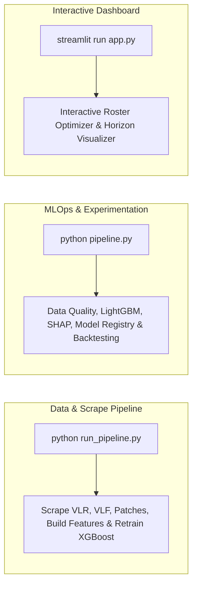

# 04. Developer, Operations & Testing Guide

This guide provides practical instructions for setting up the local environment, executing data and training pipelines, running test suites, and troubleshooting common issues.

---

## 1. Environment Setup

### Prerequisites
- **Python:** 3.10 or 3.11 recommended.
- **Operating System:** Windows, macOS, or Linux.
- **Key Dependencies:** PyTorch, SciPy, NumPy, Pydantic v2, HTTPX, LightGBM, XGBoost, Streamlit, Scikit-Learn.

### Installation
```bash
# 1. Clone repository and navigate to root
cd vct-prediction-model

# 2. Create and activate a virtual environment
python -m venv venv
# On Windows:
.\venv\Scripts\activate
# On Linux/macOS:
source venv/bin/activate

# 3. Install core dependencies
pip install -r requirements.txt
```

### Environment Variables (`.env`)
Create a `.env` file in the root directory to enable LLM semantic patch parsing and external scraping:
```ini
# LLM API configuration for v8_patch_parser.py
GEMINI_API_KEY="your-google-gemini-api-key"
# Alternatively, use OpenAI:
# OPENAI_API_KEY="your-openai-api-key"
# LLM_MODEL="gpt-4o-mini"
# LLM_API_BASE="https://api.openai.com/v1"

# Scraper user-agent headers
SCRAPER_USER_AGENT="VCTPredictionEngine/2.0 (AnalyticsBot; Contact: dev@example.com)"
```

---

## 2. Key Execution Entrypoints



### 1. Full Data Update Pipeline (`run_pipeline.py`)
Executes an end-to-end refresh of VLR matches, VLF slate salaries, patch notes semantic parsing, feature matrix generation, and XGBoost model retraining:
```bash
python run_pipeline.py

# Optional: Restrict scrape to specific tournament whitelists
python run_pipeline.py --whitelist "Champions 2026,Masters London"
```

### 2. MLOps Training & Backtesting Pipeline (`pipeline.py`)
Runs the complete V10 machine learning lifecycle (Data Quality Report, Feature Store generation, LightGBM/CatBoost training, ECE/MCE calibration metrics, SHAP explanations, Model Registry promotion, and Walk-Forward Backtesting):
```bash
python pipeline.py

# Optional: Skip historical backtesting for faster iteration
python pipeline.py --skip-backtest
```

### 3. Streamlit Web Dashboard (`app.py`)
Launches the interactive DFS roster optimization interface:
```bash
streamlit run app.py
```

---

## 3. Testing Suite & Validation

The codebase includes comprehensive unit tests verifying both mathematical logic and neural layers.

### Running PyTorch & MILP Unit Tests
```bash
# Run all tests with pytest
pytest -v

# Run specific v8 Differentiable Patch Engine tests
pytest test_v8_patch_parser.py
pytest test_v8_differentiable_base.py
pytest test_v8_breakpoint_thresholds.py
pytest test_v8_copula_aggregation.py
pytest test_v8_dros_optimizer.py

# Run specific v9 DFS Engine tests
pytest test_v9_historical_stats.py
pytest test_v9_map_scenario_simulation.py
pytest test_v9_h2h_and_calibration.py
pytest test_v9_milp_optimizer.py
pytest test_v9_multiperiod_horizon_optimizer.py
pytest test_v9_fantasy_engine.py
```

### Direct Module Verification (CLI Dry Runs)
Each core engine module includes a standalone verification block that can be run directly:
```bash
python v8_patch_parser.py
python v8_differentiable_base.py
python v8_breakpoint_thresholds.py
python v8_copula_aggregation.py
python v8_dros_optimizer.py
python v9_milp_optimizer.py
```

---

## 4. Known Architectural Blind Spots & Future Roadmap

During code-level audits, the following architectural gaps were confirmed and flagged for future development:

1. **Agent Mastery Inertia:**
   - *Current State:* Nerfs apply uniformly across all players selecting an agent.
   - *Roadmap Item:* Implement player-specific agent affinity coefficients to model comfort-pick retention during early patch weeks.

2. **Indirect Network Effects:**
   - *Current State:* Gumbel Copula synergy aggregates multi-ability nerfs on the *same* agent. Counter-buffs across opposing agents are not modeled.
   - *Roadmap Item:* Construct a bipartite counter-pick graph to propagate indirect positive concept drift to counter agents when an anchor agent is nerfed.

3. **True State-Space Kalman Filtering:**
   - *Current State:* Post-gameweek calibration uses a first-order momentum update ($\alpha = 0.20$).
   - *Roadmap Item:* Implement full state-space Kalman filters ($F, H, Q, R$) to dynamically model player form volatility versus measurement noise.

4. **Real-Time DFS Lock Throttling:**
   - *Current State:* Pipeline execution is batch-oriented without automated lock countdown enforcement.
   - *Roadmap Item:* Implement automated Celery/Redis scheduling with asynchronous lock deadline triggers.

---

## 5. Troubleshooting & FAQ

### Q1: `v8_patch_parser.py` fails with an API error or timeout.
**Resolution:** If no API key is provided, `V8PatchParser` automatically falls back to `force_offline_mock=True` using its heuristic wikitext parser. Verify your `GEMINI_API_KEY` or `OPENAI_API_KEY` in `.env` if active LLM semantic extraction is required.

### Q2: The MILP solver returns `status="infeasible"`.
**Resolution:** Infeasibility occurs when the available player pool cannot satisfy all 6 constraints simultaneously (e.g. fewer than 2 players available in a mandatory role, or minimum salary sum exceeds 100 VP). Verify that `data/processed/vfl_players_db.json` contains at least 11 players spanning all 4 canonical roles.

### Q3: Why are kill points lower than standard fantasy games?
**Resolution:** The engine implements official VLF bracketed scoring ($-3$ for 0 kills, $-1$ for 1–4 kills, $+1$ for 10 kills, $+1$ per 5 kills above 10). Linear per-kill scoring is intentional and strictly compliant with official league rules.
