# Automated Patch Analyzer & Concept Drift Engine — Technical Breakdown

This document provides an exhaustive technical breakdown of the **Patch Analyzer Pipeline** (`patch_analyzer.py`, `scrapers/patch_ingestor.py`, `patch_parser.py`, `feature_builder.py`, and `utils/v4_skills.py`).

The Patch Analyzer is designed to quantify **Concept Drift** (how significantly a Valorant balance patch alters agent behavior, gunplay dynamics, and tactical win probabilities) without needing to wait for post-patch tournament match data.

---

## 1. Data Scraping & Ingestion Layer

```mermaid
flowchart LR
    A[Valorant Wiki API / Fandom] -->|Wikitext Payload| B[scrapers/patch_ingestor.py]
    B -->|Save Raw .wiki| C[data/patches/version.wiki]
    C --> D[patch_parser.py]
    D -->|Structured JSON| E[data/processed/patches/version.json]
    E --> F[feature_builder.py]
    F -->|Feature Trees| G[data/processed/features/version.json]
```



### A. Data Source & Scraping (`scrapers/patch_ingestor.py`)
- **Source**: MediaWiki API (`https://wiki.playvalorant.com/en-us/api.php` or Fandom MediaWiki fallback).
- **Target Pages**: `Patch Notes/{version}` (e.g., `Patch Notes/13.01`, `Patch Notes/9.04`).
- **Storage**: Raw MediaWiki wikitext is saved locally in `data/patches/{version}.wiki`.
- **Patch Registry Metadata**: Cross-referenced with `data/raw/patch_notes.csv` to map release dates and patch chronologies.

### B. Wikitext Parsing (`patch_parser.py`)
`PatchParser` converts unformatted MediaWiki wikitext into structured JSON by stripping templates and extracting bullet points.
- **Template Stripping**: Strips MediaWiki tags like `{{ai|...}}`, `{{wi|...}}`, `{{abi text|...}}`, and `[[link|text]]`.
- **Heading Identification**: Uses regex headings (`== Category ==`, `=== Subject ===`) to isolate sections:
  - `agent_changes`, `weapon_changes`, `competitive_changes`, `performance_changes`, `bug_fixes`, `player_behavior_changes`.
- **Numerical Transition Matching**: Captures numeric changes using dual-regex patterns:
  - Pattern 1: `(\d+(?:\.\d+)?)\s*%?\s*(?:>>>|->)\s*(\d+(?:\.\d+)?)` (e.g. `15s >>> 20s`, `.075 -> .10`)
  - Pattern 2: `(increased|decreased)\s+from\s+(\d+(?:\.\d+)?)\s+to\s+(\d+(?:\.\d+)?)`

---

## 2. Feature Building & Semantic Mapping (`feature_builder.py`)

`feature_builder.py` transforms raw patch bullet points into standardized **Feature Trees** saved under `data/processed/features/{version}.json`.

### A. Semantic Feature Mapping (`map_semantic_feature`)
Maps plain-text descriptions into standardized category-feature pairs using priority-based token matching:

| Priority Level | Keywords / Patterns | Mapped Category | Mapped Feature |
| :--- | :--- | :--- | :--- |
| **Priority 1 (Phrases)** | `ultimate cost`, `ult points` | `economy` | `ultimate_cost` |
| | `cast speed`, `windup`, `equip time` | `ability` | `cast_time` |
| | `weapon reload`, `reload speed` | `combat` | `reload` |
| | `damage falloff`, `falloff` | `combat` | `damage_falloff` |
| **Priority 2 (Tokens)** | `duration`, `time` | `ability` | `duration` |
| | `cooldown`, `cd` | `ability` | `cooldown` |
| | `charges`, `charge` | `ability` | `charges` |
| | `health`, `hp` | `ability` | `health` |
| | `slide` | `movement` | `slide_count` |
| **Priority 3 (Broad)** | `damage` | `combat` | `damage` |
| | `magazine`, `ammo` | `combat` | `ammo` |
| | `cost`, `credits` | `economy` | `cost` |
| | `speed`, `velocity` | `movement` | `movement_speed` |

### B. Direction & Type Inference (`infer_change_type`)
The system evaluates whether a change is a `buff`, `nerf`, or `adjustment`:
- Features where **lower is better**: `["cost", "cooldown", "reload", "windup", "delay", "time", "spread", "drain", "charge_time"]`.
- If `new_val < old_val` on a lower-is-better metric $\rightarrow$ **Buff**.
- If `new_val > old_val` on a lower-is-better metric $\rightarrow$ **Nerf**.

---

## 3. Core Patch Analyzer Mechanics (`patch_analyzer.py` & `utils/v4_skills.py`)

```mermaid
graph TD
    SubGraph1[Input Data] -->|Historical Matches| WDM[Weapon Dependency Matrix P w|a]
    SubGraph1 -->|Direct Agent Changes| DirectShock[Direct Feature Shock θ_c]
    SubGraph1 -->|Weapon Balance Changes| GhostShock[Ghost Shock θ_ghost]

    DirectShock --> Aggregation[Bounded Probabilistic Union]
    GhostShock --> Aggregation
    WDM --> GhostShock
    Aggregation --> Output[Concept Drift Score]
```

### A. Weapon Dependency Matrix ($P(w|a)$)
The analyzer inspects historical match logs (`load_raw_matches()`) to compute the empirical purchase probability of weapon $w$ given agent $a$:
$$P(w|a) = \text{Probability agent } a \text{ buys weapon } w \text{ in a given round}$$

- **Operator Heavy Agents** (Jett, Chamber): $P(\text{Operator}|a) = 0.30$, $P(\text{Vandal}|a) = 0.40$, $P(\text{Phantom}|a) = 0.10$.
- **Rifles/Aggressive Agents** (Neon, Raze, Iso): $P(\text{Vandal}|a) = 0.50$, $P(\text{Phantom}|a) = 0.30$.
- **Standard Utility Agents**: $P(\text{Vandal}|a) = 0.50$, $P(\text{Phantom}|a) = 0.30$, $P(\text{Outlaw}|a) = 0.08$.

### B. Category Elasticities ($\beta_{cat}$)
Base sensitivity factors stored in `CATEGORY_ELASTICITIES`:
- `combat`: **$1.2$** (Highest impact: direct TTK and damage adjustments)
- `ability`: **$1.0$** (Standard ability adjustments)
- `movement`: **$1.0$** (Mobility shifts)
- `economy`: **$0.8$** (Credit and ult point changes)
- `general`: **$0.5$** (Qualitative text updates)
- `projectile`: **$0.4$** (Visual or projectile speed changes)

### C. Ability Power Budget Weight ($w_{ab}$)
Evaluates the importance of the modified ability to the agent's overall kit:
- **Signature / Dash Abilities** (e.g. *Tailwind*, *Toxic Screen*, *High Gear*): **$0.40$** (40% of power budget)
- **Ultimate Abilities** (e.g. *Blade Storm*, *Tour De Force*, *Resurrection*): **$0.30$** (30% of power budget)
- **Basic Utility / General**: **$0.15$**

### D. Mechanical Shock Calculation ($\theta_c$)

1. **Relative Delta ($r_c$)**:
   $$r_c = \frac{|\text{New Value} - \text{Old Value}|}{\max(|\text{Old Value}|, 0.0001)}$$
   *(For qualitative changes like reworks, $r_c = 0.50$; for removals, $r_c = 0.80$; for text tweaks, $r_c = 0.25$).*

2. **Non-Linear Saturation Shock ($\text{Shock}_c$)**:
   To model diminishing returns on large stat shifts, the relative delta is passed through a half-saturation function ($k = 0.5$):
   $$\text{Shock}_c = \frac{r_c}{r_c + 0.5}$$

3. **Feature Shock ($\theta_c$)**:
   $$\theta_c = \beta_{cat} \times w_{ab} \times \text{Shock}_c$$

### E. Indirect Ghost Shocks ($\theta_{ghost}$)
When a weapon $w$ undergoes balance changes, the shock is propagated to all playable agents weighted by their purchase preference:
$$\theta_{ghost} = \theta_{weapon\_change} \times P(w|a)$$

### F. Probabilistic Union Aggregation (Concept Drift Index)
To prevent multiple small tweaks from artificially inflating the score above $1.0$, the analyzer aggregates all direct feature shocks ($\theta_c$) and indirect ghost shocks ($\theta_{ghost}$) using the **Bounded Probabilistic Union** (De Morgan's law):

$$\text{Concept Drift Index} = 1.0 - \prod_{i=1}^{N} \left(1.0 - \min(\theta_i, 0.999)\right)$$

---

## 4. Execution Flow of `patch_analyzer.py`

When `generate_patch_distances()` is executed:

1. **API Initialization**: Fetches playable agent display names from `https://valorant-api.com/v1/agents`.
2. **Matrix Construction**: Calls `build_weapon_dependency_matrix()` to parse match logs and construct $P(w|a)$.
3. **Feature Tree Check**: Scans `data/processed/patches/*.json` for all available patch versions. If a feature tree is missing, it triggers `build_features(version)` on the fly.
4. **Shock Aggregation Loop**:
   - Loops over each `patch_version`.
   - Loops over each `agent`.
   - Computes direct agent shocks ($\theta_{direct}$).
   - Computes indirect weapon ghost shocks ($\theta_{ghost}$).
   - Calculates the combined Concept Drift Score via bounded union.
5. **Registry Export**: Writes output to two primary JSON targets:
   - `data/processed/automated_patch_nerf_registry.json`: Mapping of `[patch_version][agent] = Concept Drift Score`.
   - `data/processed/patch_impact_trace.json`: Detailed diagnostic breakdown listing each individual feature shock and its rationale (e.g. `nerf`, `buff`, `ghost_nerf`).

---

## 5. Output Data Schema Example

Excerpt from `data/processed/patch_impact_trace.json`:

```json
{
  "13.01": {
    "Yoru": {
      "score": 0.1416,
      "features": [
        {
          "feature": "ability.duration",
          "impact": 0.06,
          "reason": "buff"
        },
        {
          "feature": "movement.movement_speed",
          "impact": 0.025,
          "reason": "nerf"
        },
        {
          "feature": "general.fakeout",
          "impact": 0.025,
          "reason": "buff"
        },
        {
          "feature": "weapon.dependency",
          "impact": 0.006,
          "reason": "ghost_nerf"
        }
      ]
    }
  }
}
```
