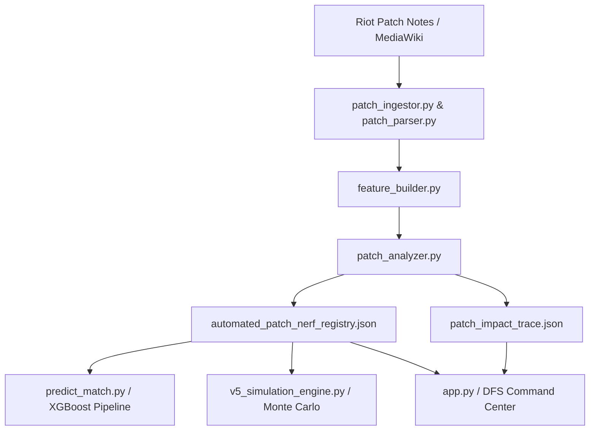

# Role & Operational Use of Patch Analyzer in VCT Prediction Model

This document outlines the role of the **Patch Analyzer** (`patch_analyzer.py`) within the broader **VCT Prediction Model & Fantasy Engine** codebase.

---

## 1. Executive Summary: The Cold-Start Problem

In professional Esports analytics, **Patch Dynamics** present a critical challenge known as the **Zero-Day Cold-Start Problem**:
- When Riot Games releases a new balance patch (e.g. Patch 13.01), there are **zero pro matches** played on that patch for several days or weeks.
- Standard Machine Learning models (XGBoost, Random Forest, Bayesian networks) trained on historical match data become immediately stale because they assume agent power levels and weapon mechanics remain constant.

The **Patch Analyzer** solves this by parsing raw patch notes wikitext upon release and converting textual balance updates into a quantitative **Concept Drift / Meta Volatility Index**. This index allows downstream prediction engines to instantly adjust player and agent projections before a single pro match is played on the new patch.

---

## 2. Core Architectural Roles in the Project



### Role A: Predictive Feature Recalibration (`predict_match.py`)
In `predict_match.py`, the system generates match outcome predictions for upcoming tournament slates. When a historical performance dataset ($p_{hist}$) is evaluated against a target match patch ($p_{target}$), `predict_match.py` queries the Patch Analyzer's registry to calculate cumulative Concept Drift penalties:

$$\text{Penalty}(a, p_{hist}, p_{target}) = \sum_{p \in (p_{hist}, p_{target}]} \text{NerfRegistry}[p][a]$$

- **Impact**: If an agent like Yoru or Clove suffered heavy nerfs between $p_{hist}$ and $p_{target}$, their historical Average Combat Score (ACS), Kill/Death (K/D), and ADR are discounted.
- **Result**: Prevents the ML model from over-projecting players who relied on heavily nerfed agents.

### Role B: Monte Carlo Variance & Uncertainty Expansion (`v5_simulation_engine.py`)
In the V5 Monte Carlo Simulation Engine, match outcomes are simulated across thousands of iterations:
- **Mean Shift**: An agent's baseline rating is adjusted downwards proportional to their Concept Drift index.
- **Uncertainty Expansion**: High concept drift increases the variance (standard deviation) of an agent's fantasy performance distribution. This reflects the tactical unpredictability of teams adapting to major meta shifts.

### Role C: Streamlit UI Concept Drift Registry (`app.py`)
In the main web application (`app.py`), the Patch Analyzer powers **Section 2: Concept Drift Registry**:
- **Patch Window Selector**: Allows users to switch between target patch windows (e.g. Patch 13.01, Patch 13.00, Patch 12.11).
- **Top Impacted Agents Display**: Displays the top-penalized agents for the active patch.
- **Trace Diagnostic View**: Integrates `patch_impact_trace.json` to explain *why* an agent's rating changed (e.g., Gatecrash duration buff vs Dimensional Drift speed nerf).

---

## 3. Practical Usage Guide

### Running the Patch Analyzer Pipeline Manually

To ingest a new patch and update the Concept Drift Registry across the entire workspace, run `run_pipeline.py` or invoke the analyzer directly:

```bash
# Option 1: Run via pipeline runner
python run_pipeline.py --patch 13.01

# Option 2: Run patch analyzer directly
python patch_analyzer.py
```

### Inspected Artifact Outputs

The analyzer produces two primary JSON artifacts consumed across the project:

1. **`data/processed/automated_patch_nerf_registry.json`**:
   Contains aggregated numerical concept drift indices consumed by `predict_match.py` and `v5_simulation_engine.py`.
   ```json
   {
     "13.01": {
       "Yoru": 0.1416,
       "Clove": 0.0825
     }
   }
   ```

2. **`data/processed/patch_impact_trace.json`**:
   Contains detailed feature-level breakdowns consumed by `app.py` for UI inspection.
   ```json
   {
     "13.01": {
       "Yoru": {
         "score": 0.1416,
         "features": [
           { "feature": "ability.duration", "impact": 0.06, "reason": "buff" },
           { "feature": "movement.movement_speed", "impact": 0.025, "reason": "nerf" }
         ]
       }
     }
   }
   ```

---

## 4. Summary of Benefits

| Project Component | Without Patch Analyzer | With Patch Analyzer |
| :--- | :--- | :--- |
| **Match Winner Prediction** | Stale predictions on new patches until weeks of data are collected. | Instant adaptation on Day 1 of new patches. |
| **DFS Fantasy Optimizer** | Overvalues nerfed players based on outdated high ACS stats. | Discounts nerfed players and boosts un-nerfed alternatives. |
| **Simulation Engine** | Ignores meta volatility. | Expands simulation variance for high-drift agents. |
| **User Transparency** | Black-box performance drops. | Clear diagnostic breakdowns in the UI (`patch_impact_trace.json`). |
